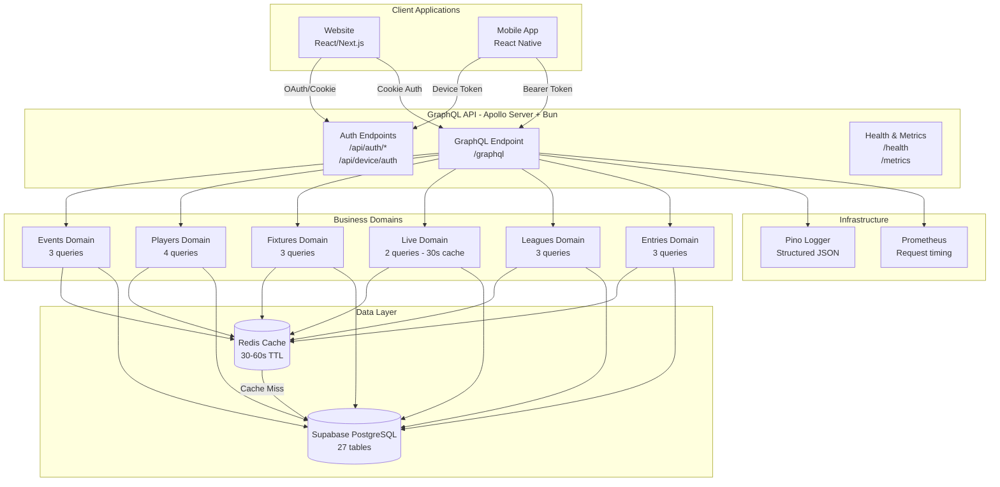
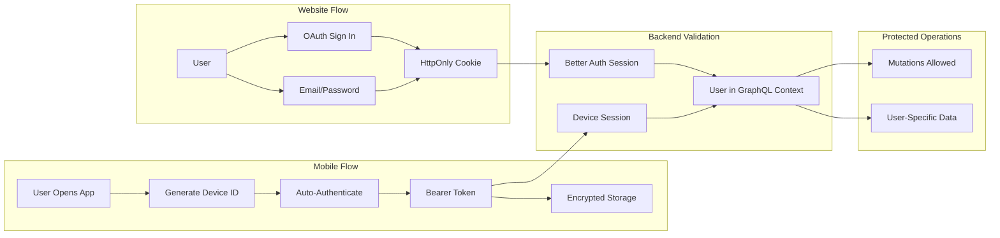
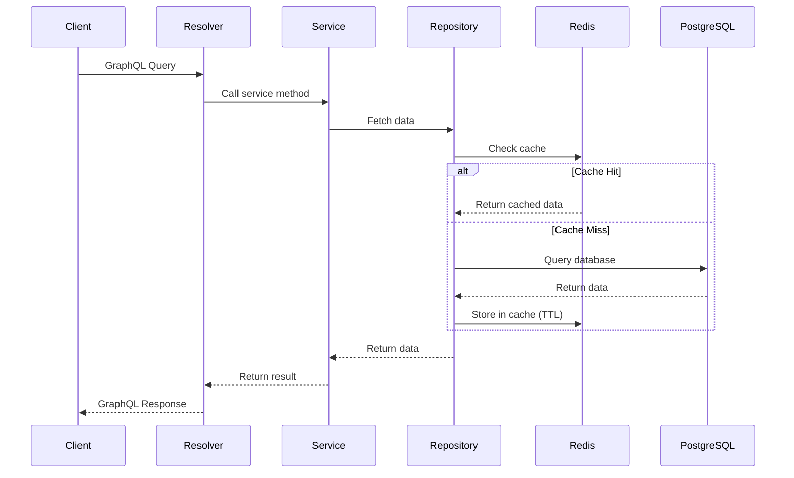
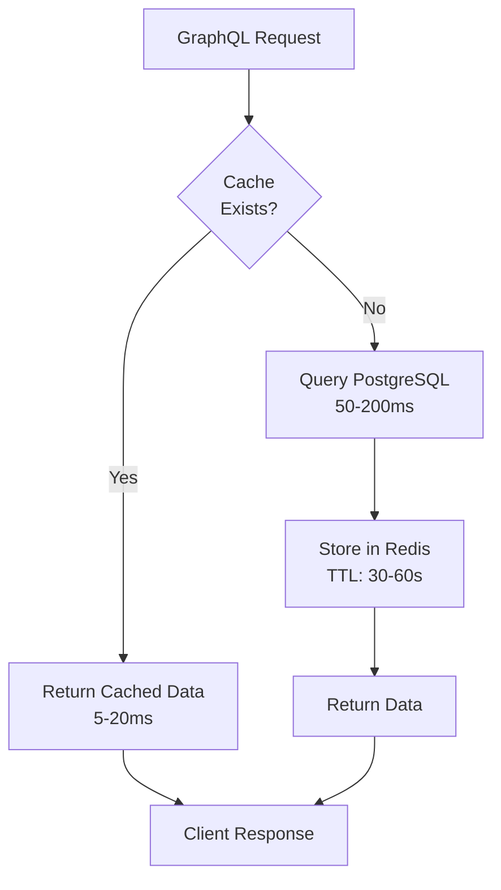
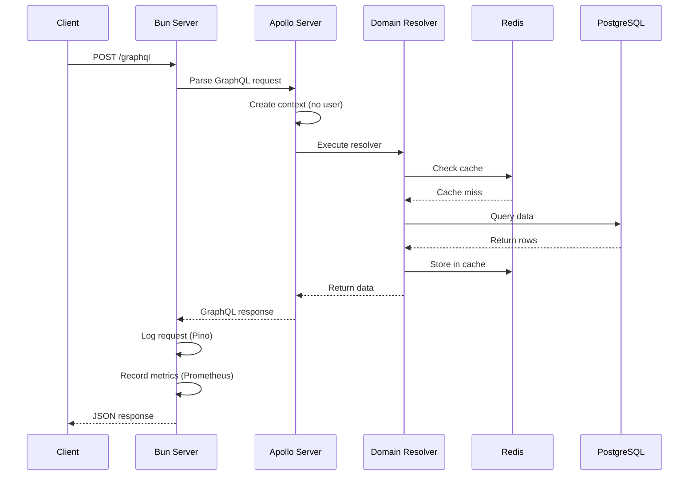
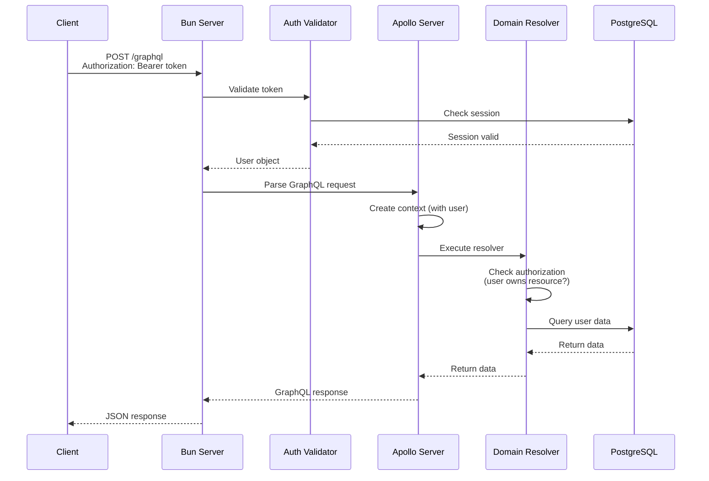

# Architecture Overview

Complete system architecture for the Fantasy Football GraphQL API.

---

## 🏗️ System Architecture



---

## 🔐 Authentication Architecture



---

## 📦 Domain Architecture

### Domain Structure Pattern

Each domain follows the same clean architecture:

```
domain/
├── schema.ts       # GraphQL type definitions
├── repository.ts   # Data access (DB + Cache)
├── service.ts      # Business logic
└── resolvers.ts    # GraphQL resolvers
```

### Data Flow



---

## 🗄️ Database Schema (27 Tables)

### Core Game Data
- `events` - Game weeks and deadlines
- `phases` - Season phases
- `teams` - Football teams
- `players` - Player database
- `player_stats` - Player performance per event
- `player_values` - Price tracking
- `event_fixtures` - Match schedules
- `event_lives` - Live scores
- `event_live_summaries` - Live summaries
- `event_live_explains` - Live explanations

### User & Entry Data
- `entry_infos` - User teams
- `entry_event_picks` - Squad selections
- `entry_event_results` - Performance per event
- `entry_event_transfers` - Transfer history
- `entry_history_infos` - Historical data

### Social Features
- `entry_league_infos` - User league memberships
- `league_event_results` - League results per event
- `entry_event_cup_results` - Cup competition results

### Tournaments (Deferred)
- `tournament_infos`
- `tournament_entries`
- `tournament_groups`
- `tournament_knockouts`
- `tournament_battle_group_results`
- `tournament_knockout_results`
- `tournament_points_group_results`

---

## 🔄 Caching Strategy

### Cache-First Pattern



### Cache Keys Pattern

```
{domain}:{operation}:{params}

Examples:
- events:id:21
- players:list:{filter:{position:3},limit:50,offset:0}
- fixtures:current
- live:scores:21
- leagues:standings:{leagueId:123,limit:50}
```

---

## 🚀 Request Flow

### Unauthenticated Request (Public Data)



### Authenticated Request (Protected Data)



---

## 🎯 Design Principles

### 1. Domain-Driven Design (DDD)
- Organized by business capability
- Not mirroring database tables
- Each domain is self-contained

### 2. Single Responsibility
- Repository: Data access only
- Service: Business logic only
- Resolver: GraphQL mapping only

### 3. Separation of Concerns
- Clear boundaries between layers
- No business logic in resolvers
- No GraphQL knowledge in repositories

### 4. DRY (Don't Repeat Yourself)
- Shared utilities (caching, mapping)
- Reusable patterns across domains
- Consistent error handling

### 5. Clear Dependencies
```
Resolver → Service → Repository → (Cache/DB)
   ↓
Context (injected dependencies)
```

---

## 📈 Performance Optimization

### Implemented
- ✅ Redis caching (cache-first reads)
- ✅ Connection pooling (Supabase client)
- ✅ Query pagination (limit/offset)
- ✅ Indexed database queries
- ✅ Efficient field resolvers

### Future Optimizations
- ⏳ DataLoader (batch + cache N+1 queries)
- ⏳ Query complexity limits
- ⏳ Rate limiting per user
- ⏳ CDN for static assets
- ⏳ Database read replicas

---

## 🔍 Monitoring & Observability

### Logging (Pino)
```json
{
  "level": 30,
  "time": 1768743984493,
  "service": "letletme-graphql",
  "method": "POST",
  "path": "/graphql",
  "status": 200,
  "durationMs": 820.97,
  "msg": "request"
}
```

### Metrics (Prometheus)
- `http_request_duration_seconds` - Request latency histogram
- Labels: method, path, status
- Accessible at `/metrics`

### Health Checks
- `/health` - Simple "ok" response
- Can be extended with database connectivity checks

---

## 🛠️ Technology Choices

### Why Apollo Server?
- ✅ Industry standard
- ✅ Rich ecosystem & tooling
- ✅ Apollo Studio integration
- ✅ Mature & stable

### Why Bun?
- ✅ Fast startup & execution
- ✅ Built-in TypeScript support
- ✅ Native Web APIs (Request, Response)
- ✅ Modern & actively developed

### Why Better Auth?
- ✅ Full control (no vendor lock-in)
- ✅ Flexible (supports custom flows)
- ✅ TypeScript-first
- ✅ Works with existing database

### Why Redis?
- ✅ Fast in-memory cache
- ✅ TTL support out of the box
- ✅ Simple key-value API
- ✅ Production-proven

---

## 📊 Comparison: Before vs. After

### Before (Assumed Java/Spring)
```
✗ Monolithic REST endpoints
✗ Multiple API calls for related data
✗ Over-fetching (fixed responses)
✗ Under-fetching (multiple round-trips)
✗ Tight coupling to database structure
```

### After (GraphQL)
```
✓ Domain-driven GraphQL API
✓ Single request for related data
✓ Client specifies exact fields needed
✓ Efficient N+1 prevention with caching
✓ Decoupled from database structure
✓ Strongly typed (TypeScript + GraphQL schema)
```

---

## 🎯 Success Metrics

### Current Status
- ✅ 6 domains implemented
- ✅ 18 queries operational
- ✅ 100% TypeScript typed
- ✅ Zero lint errors
- ✅ Redis caching working
- ✅ Logging & metrics operational
- ✅ 5 comprehensive documentation files

### When Auth Complete
- ✅ Website OAuth working
- ✅ Mobile device auth working
- ✅ Protected mutations functional
- ✅ User-specific data secured
- ✅ Cross-platform authentication

---

**Architecture Version**: 1.0  
**Last Updated**: 2026-01-18  
**Status**: ✅ Production Ready (Read Operations)
