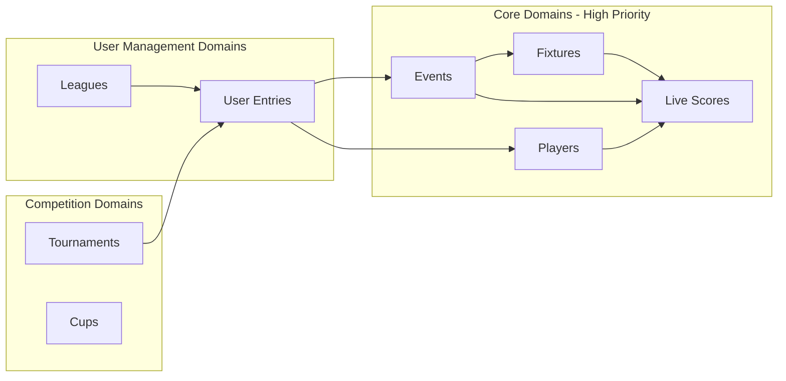

# GraphQL Domain Plan - Fantasy Football Platform

## Executive Summary

This document outlines the business-domain GraphQL architecture for the Fantasy Football platform. Instead of exposing 27 database tables as-is, we design around **user journeys** and **business use cases**.

## Design Principles

1. **Domain-Driven Design (DDD)** - Group by business capability, not database structure
2. **User Journey Focus** - APIs match how clients consume data
3. **Aggregate Data** - Combine related tables into meaningful types
4. **Cache-First** - Redis for read-heavy operations
5. **Query Efficiency** - Minimize N+1 problems with DataLoader (future)

---

## Database to Domain Mapping

### Raw Database (27 Tables)
```
events, phases, players, teams, player_stats, player_values,
event_fixtures, event_lives, event_live_summaries, event_live_explains,
entry_infos, entry_event_picks, entry_event_results, entry_event_transfers,
entry_history_infos, entry_league_infos, league_event_results,
entry_event_cup_results, tournament_*
```

### Business Domains (7 Domains)
```
Events, Players, Fixtures, Live, Entries, Leagues, Tournaments
```

---

## Domain Architecture



---

## Domain Breakdown

### 1. Events Domain ✅ (COMPLETED)

**Purpose**: Game weeks, deadlines, current status

**DB Tables**: `events`, `phases`

**GraphQL Types**:
```graphql
type Event {
  id: Int!
  name: String!
  deadline: DateTime
  isCurrent: Boolean!
  statistics: EventStatistics
}

type EventStatistics {
  averageScore: Int
  highestScore: Int
  mostCaptained: Player
  mostSelected: Player
  mostTransferredIn: Player
}

type Query {
  currentEvent: Event
  event(id: Int!): Event
  events(filter: EventsFilter, limit: Int): [Event!]!
  currentEventInfo: CurrentEventInfo  # Already implemented
}
```

**Status**: ✅ Implemented (basic queries)

---

### 2. Players Domain 🔧 (HIGH PRIORITY)

**Purpose**: Player information, statistics, value tracking

**DB Tables**: `players`, `teams`, `player_stats`, `player_values`

**Business Use Cases**:
- Browse players by position/team/price
- Compare player statistics
- Track player form and value changes
- Identify transfer targets

**GraphQL Types**:
```graphql
enum Position {
  GOALKEEPER
  DEFENDER
  MIDFIELDER
  FORWARD
}

type Team {
  id: Int!
  name: String!
  shortName: String!
  strength: Int!
  position: Int!
  form: String
  fixtures(limit: Int = 5): [Fixture!]!
}

type Player {
  id: Int!
  code: Int!
  webName: String!
  firstName: String
  secondName: String
  team: Team!
  position: Position!
  
  # Pricing
  currentPrice: Int!
  priceChange: Int!
  priceChangeStart: Int!
  
  # Current form (from player_stats for latest event)
  form: Float
  totalPoints: Int!
  pointsPerGame: Float
  
  # Expected stats
  expectedGoals: Float
  expectedAssists: Float
  
  # Ownership
  selectedByPercent: Float
  
  # Related data
  stats(eventId: Int): PlayerStats
  recentStats(limit: Int = 5): [PlayerStats!]!
  upcomingFixtures(limit: Int = 5): [Fixture!]!
}

type PlayerStats {
  event: Event!
  player: Player!
  totalPoints: Int!
  minutes: Int
  goalsScored: Int
  assists: Int
  cleanSheets: Int
  bonus: Int
  bps: Int
  influence: Float
  creativity: Float
  threat: Float
  ictIndex: Float
}

type Query {
  # Player queries
  player(id: Int!): Player
  players(
    position: Position
    teamId: Int
    maxPrice: Int
    minPrice: Int
    sortBy: PlayerSortField
    limit: Int = 50
    offset: Int = 0
  ): [Player!]!
  
  # Top performers
  topScorers(limit: Int = 10): [Player!]!
  topAssists(limit: Int = 10): [Player!]!
  bestValue(position: Position, limit: Int = 10): [Player!]!
  
  # Team queries
  team(id: Int!): Team
  teams: [Team!]!
}
```

**Repository Pattern**:
- `playersRepository.getById()` - Cache player by ID
- `playersRepository.list()` - Filter/sort with Redis cache
- `playersRepository.getTopScorers()` - Aggregate from player_stats
- `teamsRepository.getById()` - Cache team data
- Join with `player_stats` for latest event stats

---

### 3. Fixtures Domain 🔧 (HIGH PRIORITY)

**Purpose**: Match schedules, results, difficulty ratings

**DB Tables**: `event_fixtures`

**Business Use Cases**:
- Check upcoming fixtures for team planning
- View match results
- Assess fixture difficulty

**GraphQL Types**:
```graphql
type Fixture {
  id: Int!
  event: Event!
  kickoffTime: DateTime
  homeTeam: Team!
  awayTeam: Team!
  homeScore: Int
  awayScore: Int
  finished: Boolean!
  started: Boolean
  minutes: Int
  
  # Difficulty ratings (1-5)
  homeTeamDifficulty: Int
  awayTeamDifficulty: Int
  
  # Match stats (goals, cards, etc.)
  stats: FixtureStats
}

type FixtureStats {
  goalsScored: [FixtureStat!]!
  assists: [FixtureStat!]!
  yellowCards: [FixtureStat!]!
  redCards: [FixtureStat!]!
  saves: [FixtureStat!]!
}

type FixtureStat {
  player: Player!
  value: Int!
}

type Query {
  fixture(id: Int!): Fixture
  fixtures(
    eventId: Int
    teamId: Int
    finished: Boolean
    limit: Int = 50
  ): [Fixture!]!
  
  # Upcoming fixtures for a team
  teamFixtures(teamId: Int!, limit: Int = 5): [Fixture!]!
  
  # Current gameweek fixtures
  currentFixtures: [Fixture!]!
}
```

---

### 4. Live Domain 🔧 (MEDIUM PRIORITY)

**Purpose**: Real-time player performance during matches

**DB Tables**: `event_lives`, `event_live_summaries`, `event_live_explains`

**Business Use Cases**:
- Track live scores during active gameweek
- See player points updating in real-time
- Understand bonus points calculations

**GraphQL Types**:
```graphql
type LivePerformance {
  event: Event!
  player: Player!
  
  # Live stats
  minutes: Int
  goalsScored: Int
  assists: Int
  cleanSheets: Int
  goalsConceded: Int
  ownGoals: Int
  penaltiesSaved: Int
  penaltiesMissed: Int
  yellowCards: Int
  redCards: Int
  saves: Int
  
  # Bonus points
  bonus: Int
  bps: Int
  inDreamTeam: Boolean
  
  # Points
  totalPoints: Int!
  
  # Expected stats
  expectedGoals: Float
  expectedAssists: Float
}

type LiveSummary {
  event: Event!
  lastUpdated: DateTime!
  fixtures: [Fixture!]!
  performances: [LivePerformance!]!
}

type Query {
  # Live data for current event
  liveScores: LiveSummary
  
  # Player live performance
  playerLive(playerId: Int!, eventId: Int): LivePerformance
  
  # All live performances for an event
  eventLive(eventId: Int!): [LivePerformance!]!
}
```

**Special Considerations**:
- High read frequency during match days
- Cache aggressively (30s-1min TTL)
- Consider GraphQL subscriptions for real-time updates (future)

---

### 5. Entries Domain 🔧 (HIGH PRIORITY)

**Purpose**: User squads, picks, transfers, history

**DB Tables**: 
- `entry_infos`
- `entry_event_picks`
- `entry_event_transfers`
- `entry_event_results`
- `entry_history_infos`

**Business Use Cases**:
- View user's team and points
- See historical picks and transfers
- Track overall rank and performance
- Plan transfers for next gameweek

**GraphQL Types**:
```graphql
type Entry {
  id: Int!
  entryName: String!
  playerName: String!
  region: String
  
  # Current status
  overallPoints: Int!
  overallRank: Int
  bank: Int!
  teamValue: Int!
  totalTransfers: Int
  
  # History
  history: [EntryEventHistory!]!
  
  # Current picks
  currentPicks(eventId: Int): EntryPicks
  
  # Transfers
  transfers(eventId: Int): [Transfer!]!
}

type EntryPicks {
  event: Event!
  chip: Chip
  picks: [Pick!]!
  captain: Player!
  viceCaptain: Player!
  bench: [Pick!]!
}

type Pick {
  player: Player!
  position: Int!
  multiplier: Int!  # 1 = normal, 2 = captain, 3 = triple captain
  isCaptain: Boolean!
  isViceCaptain: Boolean!
}

type Transfer {
  event: Event!
  playerIn: Player!
  playerOut: Player!
  cost: Int!
}

enum Chip {
  BENCH_BOOST
  FREE_HIT
  TRIPLE_CAPTAIN
  WILDCARD
}

type EntryEventHistory {
  event: Event!
  points: Int!
  totalPoints: Int!
  rank: Int
  overallRank: Int
  bank: Int
  teamValue: Int
  transfersCost: Int
}

type Query {
  entry(id: Int!): Entry
  myEntry: Entry  # Requires auth
  
  # Entry details
  entryPicks(entryId: Int!, eventId: Int): EntryPicks
  entryHistory(entryId: Int!): [EntryEventHistory!]!
  entryTransfers(entryId: Int!, eventId: Int): [Transfer!]!
}

type Mutation {
  # Transfer management (requires auth)
  makeTransfers(
    eventId: Int!
    transfersIn: [Int!]!
    transfersOut: [Int!]!
  ): EntryPicks!
  
  # Set captain/vice captain
  setCaptain(eventId: Int!, playerId: Int!): EntryPicks!
  
  # Play chip
  playChip(eventId: Int!, chip: Chip!): EntryPicks!
}
```

**Special Considerations**:
- Authentication required for mutations
- Validate transfer rules (budget, squad limits)
- Cache user picks per event

---

### 6. Leagues Domain 🔧 (MEDIUM PRIORITY)

**Purpose**: League standings, head-to-head, cups

**DB Tables**: 
- `entry_league_infos`
- `league_event_results`
- `entry_event_cup_results`

**Business Use Cases**:
- View league standings
- Track mini-league performance
- See head-to-head results
- Cup progression

**GraphQL Types**:
```graphql
enum LeagueType {
  CLASSIC
  HEAD_TO_HEAD
  CUP
}

type League {
  id: Int!
  name: String!
  type: LeagueType!
  
  # Standings
  standings(limit: Int = 50, offset: Int = 0): [LeagueStanding!]!
  
  # Event-specific results
  eventResults(eventId: Int!): [LeagueEventResult!]!
}

type LeagueStanding {
  rank: Int!
  entry: Entry!
  totalPoints: Int!
  lastRank: Int
}

type LeagueEventResult {
  event: Event!
  entry: Entry!
  points: Int!
  totalPoints: Int!
  rank: Int!
}

type Query {
  league(id: Int!): League
  entryLeagues(entryId: Int!): [League!]!
}
```

**Special Considerations**:
- Different logic for classic vs H2H leagues
- Cups have knockout brackets (complex)
- Consider separating Cups into own domain

---

### 7. Tournaments Domain 🔧 (LOW PRIORITY - Complex)

**Purpose**: Custom tournament competitions with groups, knockouts, points

**DB Tables** (7 tables):
- `tournament_infos`
- `tournament_entries`
- `tournament_groups`
- `tournament_knockouts`
- `tournament_battle_group_results`
- `tournament_knockout_results`
- `tournament_points_group_results`

**Business Use Cases**:
- Custom competitions outside main game
- Group stage standings
- Knockout bracket progression
- Tournament-specific scoring

**GraphQL Types**:
```graphql
type Tournament {
  id: Int!
  name: String!
  description: String
  startEvent: Event!
  endEvent: Event
  
  # Structure
  groups: [TournamentGroup!]!
  knockouts: [TournamentKnockout!]!
  
  # Participants
  entries: [TournamentEntry!]!
  
  # Standings
  groupStandings(groupId: Int!): [TournamentGroupStanding!]!
}

type TournamentGroup {
  id: Int!
  name: String!
  standings: [TournamentGroupStanding!]!
}

type TournamentGroupStanding {
  rank: Int!
  entry: Entry!
  points: Int!
  wins: Int!
  draws: Int!
  losses: Int!
}

type TournamentKnockout {
  id: Int!
  round: String!
  matches: [TournamentMatch!]!
}

type TournamentMatch {
  entry1: Entry!
  entry2: Entry!
  entry1Score: Int
  entry2Score: Int
  winner: Entry
}

type Query {
  tournament(id: Int!): Tournament
  tournaments(active: Boolean): [Tournament!]!
}
```

**Special Considerations**:
- Most complex domain
- Multiple scoring systems
- Battle groups + knockout stages
- Consider implementing last (or skip if not used)

---

## Implementation Checklist

### Phase 1: Core Game Data (Weeks 1-2)
- [x] Events Domain - Basic queries ✅
- [ ] Events Domain - Add statistics aggregation
- [ ] Events Domain - Add phases support
- [ ] Players Domain - Complete implementation
  - [ ] Player repository with caching
  - [ ] Team repository
  - [ ] Player stats aggregation
  - [ ] Top performers queries
- [ ] Fixtures Domain - Complete implementation
  - [ ] Fixture repository
  - [ ] Team fixtures query
  - [ ] Current gameweek fixtures

### Phase 2: Live & User Data (Weeks 3-4)
- [ ] Live Domain
  - [ ] Live performance queries
  - [ ] Cache strategy (short TTL)
  - [ ] Consider subscriptions
- [ ] Entries Domain
  - [ ] Entry info queries
  - [ ] Picks and transfers queries
  - [ ] Entry history
  - [ ] Auth setup for mutations

### Phase 3: Social Features (Weeks 5-6)
- [ ] Leagues Domain
  - [ ] Classic leagues
  - [ ] League standings
  - [ ] Event-specific results
- [ ] Cups (if needed)
  - [ ] Cup brackets
  - [ ] Results tracking

### Phase 4: Advanced Features (Week 7+)
- [ ] Tournaments Domain (if needed)
  - [ ] Group stage
  - [ ] Knockout stage
  - [ ] Complex scoring
- [ ] Performance Optimization
  - [ ] DataLoader for N+1 prevention
  - [ ] Query complexity limits
  - [ ] Redis cache tuning
- [ ] GraphQL Subscriptions
  - [ ] Live score updates
  - [ ] Real-time rank changes

---

## Technical Decisions

### Leagues vs Tournaments

**Leagues** and **Tournaments** serve different purposes:

| Feature | Leagues | Tournaments |
|---------|---------|-------------|
| **Type** | Ongoing season-long competition | Standalone competition with start/end |
| **Structure** | Simple standings table | Groups + Knockout stages |
| **Scoring** | Cumulative points | Custom rules (battle points) |
| **Complexity** | Low | High |
| **Tables** | 2 tables | 7 tables |
| **Priority** | High (core feature) | Low (optional feature) |

**Recommendation**:
1. **Implement Leagues first** - Essential for users to compete with friends
2. **Defer Tournaments** - Complex, less commonly used, can be added later
3. **Keep separate domains** - Don't merge; different business logic

### Authentication Strategy

**Current**: No auth (public queries only)

**Future** (for mutations):
- Add auth middleware to GraphQL context
- Integrate with Supabase Auth
- Protected mutations: transfers, captaincy, chips
- Row-level security in Supabase

### Caching Strategy by Domain

| Domain | Cache TTL | Reason |
|--------|-----------|--------|
| Events | 60s | Changes infrequently |
| Players | 60s | Updated once per day |
| Fixtures | 60s | Schedule rarely changes |
| **Live** | **30s** | Updates during matches |
| Entries | 60s | User-specific, less traffic |
| Leagues | 60s | Updated after each event |

---

## Next Steps

1. **Review and approve** this plan
2. **Prioritize domains** - Which to implement first?
3. **Start with Players Domain** - Most commonly queried after Events
4. **Iterate based on frontend needs** - Add queries as required

---

## Questions to Answer

1. **Do you need Tournaments?** - 7 tables, high complexity
2. **Authentication priority?** - When to add mutations?
3. **Real-time requirements?** - GraphQL subscriptions for live scores?
4. **Frontend use cases?** - What screens/features drive API design?

---

**Last Updated**: 2026-01-18
**Status**: Planning Phase
**Next Domain**: Players (High Priority)
