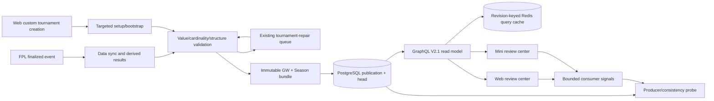
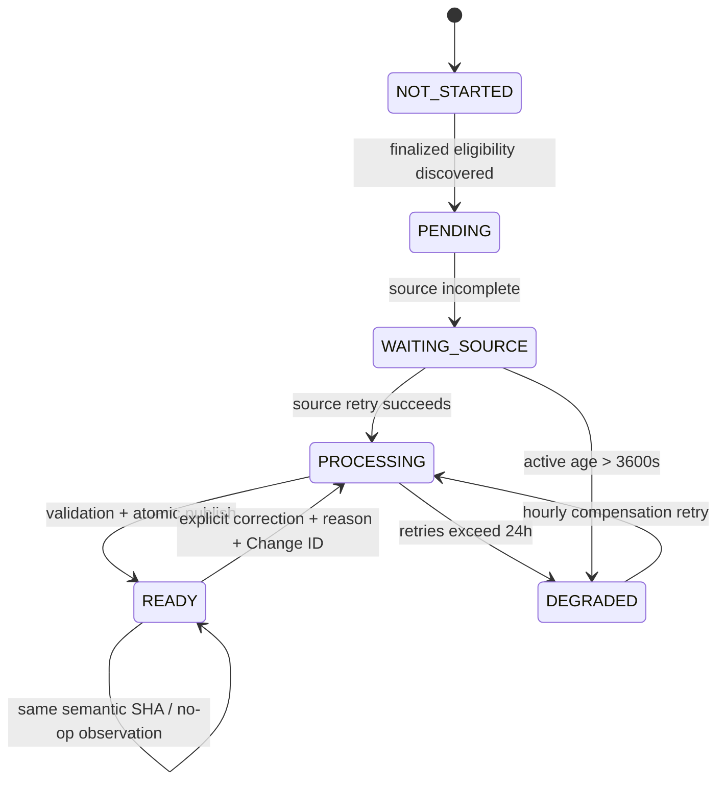

# My LetLetMe 赛事复盘 V2.1

## 端到端实现与发布验收报告

| 项目         | 值                                                                                                                  |
| ------------ | ------------------------------------------------------------------------------------------------------------------- |
| Workset      | `WS-20260901-myfpl-v2-hard-cut`                                                                                     |
| 评审对象     | Data → PostgreSQL → GraphQL → Redis query cache → Web → 小程序 → VPS Ops                                            |
| 业务示例     | `6953`，始终表示 FPL Entry ID；不是 tournament ID，也不是 admin capability                                          |
| 锁定合约     | `X-LetLetMe-Contract: my-tournament-review-v2.1`                                                                    |
| 数据 metric  | `settled-review-v2`                                                                                                 |
| 评审日期     | 2026-09-01                                                                                                          |
| 本文证据边界 | 本地隔离 worktree 的代码、静态门禁和测试；不把生产迁移、部署、Chrome 登录态、小程序发布或 24 小时运行证据写成已完成 |

## 1. 结论先行

本次实现按 V2 单轨硬切完成了五个运行时资产的代码改造：

- Data 增加 0084 破坏性迁移（0083 已被上游 Live Matches V3 占用）、publication chunks、语义 SHA、READY 冻结、显式 correction、repair 关联和自定义赛事 targeted bootstrap。
- GraphQL 只暴露 V2.1 roots，旧 V1 roots 从 schema 和 runtime policy 移除；V2.1 contract gate、授权、分页、chunk 完整性校验和 revision-keyed query cache 已对齐。
- Web 以 Season 为默认视图，按 latest finalized 选择，支持显式 previous-ready 历史入口、phase timeline、Points/H2H/KO sections、Admin ALL 分页和 custom setup 状态。
- 小程序删除旧 V1 review 分支、旧 operations 与持久化 review cache，使用同一 V2.1 字段、Gross/Cost/Net 口径、phase tabs、分页和 426 升级处理。
- VPS Ops 使用 `watch_entry_id: 6953`，同时保留当前赛季全赛事 aggregate probe，并把 active pending、degraded、publication/head/manifest/chunk parity 纳入告警。

这不是“已上线”声明。发布窗口还必须完成备份恢复演练、迁移执行、当前赛季重建、五个 exact SHA 部署、Web/小程序可见行为、生产级负载和 24 小时 shadow-v4 证据。没有这些证据就不能关闭 Workset，也不能启用 enforce-v4。

## 2. 业务和页面模型（Web 为标准）

“我的 LetLetMe 赛事复盘”是以已结算快照为基础的赛事复盘中心，不是准实时积分页：

| 场景           | 数据边界                                                 | 页面行为                                               |
| -------------- | -------------------------------------------------------- | ------------------------------------------------------ |
| Season         | 截止所选 finalized GW 的累计 bundle，包含此前冻结 phases | 默认打开；看累计竞争格局、排名走势、跨阶段 history     |
| Gameweek       | 一个 finalized GW 的固定快照                             | 看单轮表现；Points 的“本轮积分”=Gross，Cost/Net 分列   |
| Live           | 未 finalized 或正在处理的 GW                             | 复盘页不猜测，统一提供 Live 入口                       |
| Previous ready | 用户主动选择的历史已 READY GW                            | 仅作为显式历史导航，不是最新 GW 不 READY 时的 fallback |

最新 finalized GW 的状态必须原样展示：`PENDING`、`WAITING_SOURCE`、`PROCESSING`、`DEGRADED`、`READY` 或 `NOT_STARTED`。如果最新轮尚未 READY，页面不得偷偷显示旧 READY 数据。

### 2.1 赛事类型与复盘内容

- **Points phase**：赛事 Net 排名、累计 Gross、transfer cost、Net、viewer 排名/差距和走势。
- **H2H phase**：group、W-D-L、match points、PF/PA、最近五场 form、完整赛程/结果和晋级状态。
- **Knockout phase**：round、match、双方 Net、winner、晋级/淘汰关系和 champion path。
- **跨 phase**：H2H→KO、Points→KO 时保留前阶段复盘；Season 返回有序 `phases[]`，不只返回最后一种格式。
- **自定义赛事**：Web 创建成功后立即出现在 catalog；setup READY 立即触发 targeted bootstrap，历史 scope 按 GW 升序建立。

所有用户可见文案统一使用“赛事 / 赛事复盘 / Tournament”，不使用“官方赛事/官方联赛”作为产品口径。内部 `participantSource=official|custom` 可以继续作为数据字段，但不是 UI 文案。

### 2.2 权限语义

| scope        | 允许主体                                        | 说明                           |
| ------------ | ----------------------------------------------- | ------------------------------ |
| `ACCESSIBLE` | 当前 verified entry 是赛事成员                  | 普通用户默认范围               |
| `MANAGED`    | 当前 verified entry 是赛事 admin                | 管理员可见其管理赛事           |
| `ALL`        | signed platform-admin capability + 正常 ingress | 不是传入 6953 就自动成为 admin |

`6953` 只用于 watch/示例 entry。每个 catalog、gameweek、season、section、status 请求重新校验 principal 与赛事关系；cursor 不能绕过授权。Web 只有在 ALL 明确返回 403/FORBIDDEN 时才回到 ACCESSIBLE，不能把任意网络错误当成 fallback。

## 3. 目标链路



事实边界是：PostgreSQL 是业务真相；Data publication/head 是可见性 checkpoint；Redis 只缓存 GraphQL 查询结果。GraphQL 不写 Data 业务表、不运行 DDL、不直接修 Redis。

## 4. Data 与存储实现

### 4.1 0084 迁移和破坏性边界

`migrations/0084_my_tournament_review_v2_1_hard_cut.sql` 由 Data 单独执行（0083 已被上游 Live Matches V3 占用，不能复用），目标是一次性清理当前赛季旧 review 状态并建立可恢复的 V2.1 结构：

1. 备份 publication、head、obligation 三张表，记录 season 行数、revision 分布、head parity、SHA 清单和恢复演练标记。
2. 非当前赛季 `descriptive-v1` 作为只读历史证据保留；当前赛季旧 publication/head/obligation 删除，revision 从 1 重新开始。
3. 保留原物理表名和 `content_sha256` 物理列；新公开语义名为 `semanticSha256`，避免无价值的表级迁移。
4. 新增 `competition.tournament_review_publication_chunks`，主键为 season/tournament/event/revision/section/chunkIndex；每块最多 100 项，带 `item_count`、`chunk_sha256`、JSONB 数组约束、FK、RLS、reader/writer grants 和级联删除规则。
5. publication payload 改为轻量 manifest；大数组存入 chunks。obligation 增加 `last_observed_at`、`last_noop_at`、`last_semantic_change_at`、`repair_issue_id`。
6. correction publication 强制 `correction_reason` 与 `correction_change_id`；revision 1 不得携带 correction，revision > 1 必须携带。

迁移是破坏性动作，必须在生产结构副本完成 forward、备份恢复、current-season reset、RLS/grant 和 reader/writer contract 演练后才可执行。本文只记录代码实现，未执行线上删除。

### 4.2 固定快照、manifest 和语义 SHA

每个 `(season, tournament, finalizedEvent)` bundle 同时包含：该 GW 的 Gameweek 结果、截止该 GW 的完整 Season phase manifest，以及 Points/H2H/KO 分节 chunk 描述。

语义哈希规则固定如下：

1. 去除抓取、观察、更新时间和发布时间等运维字段，对业务 manifest 做 canonical JSON。
2. 每个 section 的 chunks 按 `sectionKey + chunkIndex` 排序；空 section 也有一个 `chunkIndex=0`、`item_count=0` 的零项 chunk，避免“没有行”和“未发布”混淆。
3. `semanticSha256 = SHA256(canonicalManifest + orderedChunkHashes)`。
4. `settledAt`、`publishedAt`、`correctedAt`、`lastObservedAt` 不进入语义哈希。
5. chunks、publication、head 和 obligation 在同一 PostgreSQL transaction、同一 advisory lock 内写入；head 是唯一可见性开关。

候选 SHA 与 active head 相同：只更新 observation/no-op 证据，不创建 revision。READY 后普通同步不会移动 head；只有带原因和 Change ID 的 CORRECTION 才能创建下一 revision。Season bundle 从此前冻结的 publication 递推，再加入当前 GW，不能每次从会变化的源表重算历史。

### 4.3 发布前完整性规则

- Event 必须 `finished=true`、`data_checked=true` 且 `data_checked_at` 非空。
- Tournament setup 必须 READY，GW 必须位于实际 group/knockout 区间。
- Roster 人数、唯一性、适用 GW、group assignment 与 canonical rows 完全一致。
- Points：`grossPoints = event_points`；`transferCost = event_transfers_cost`；`netPoints = grossPoints - transferCost`。不重复应用 captain/bench/autosub multiplier。
- H2H：每个适用 entry 每轮恰好一次，或命中显式 average/bye 规则；双方 Net 与 entry result 相等；3/1/0 match points 由 Net 重算；standings、W-D-L、PF/PA、form 从冻结 fixtures 推导。
- Knockout：round、match、playAgainst、bracket edge 完整；winner 满足 Net、进球、失球和 entry ID 决胜规则；晋级/淘汰/champion path 可由完整 bracket 重建。
- manifest section/chunk/item count、每块 SHA、最终 semantic SHA、READY obligation、head revision 四方闭合；任意 partial candidate 不激活。

Points/H2H upsert 在业务字段不变时保留 `updated_at`，观察时间单独记录，消除重复 T6/T7 拉取造成的写放大和假 DEGRADED。

### 4.4 失败补偿

继续复用现有 `tournament-repair`，不新增第二套修复基础设施：

| 失败                        | issue/fingerprint                                          | 补偿                                                          |
| --------------------------- | ---------------------------------------------------------- | ------------------------------------------------------------- |
| 结果缺失或数值不一致        | `TOURNAMENT_RESULTS_INCOMPLETE:<eventId>`                  | 去重 issue，repair 成功后精确 enqueue tournament/event review |
| roster/group/bracket 不一致 | `STRUCTURE_INTEGRITY_FAILED`                               | obligation 保存 `repair_issue_id`，成功后重试原 scope         |
| source retry                | 60、180、600 秒，后续每 900 秒至 24 小时                   | 24 小时后 DEGRADED，仍每 3600 秒重试并告警                    |
| execution retry             | 60、300、900 秒，后续每 900 秒至 24 小时                   | 同上；重复 fingerprint 只抑制通知，不抑制重试                 |
| custom setup READY          | targeted bootstrap                                         | 不等待下一次 5 分钟全局轮询                                   |
| 显式 correction             | `{tournamentId,eventId,mode:"CORRECTION",reason,changeId}` | 重建被纠正 GW 及其后的 Season bundles                         |

## 5. GraphQL V2.1 合约与读路径

### 5.1 Contract gate 和 roots

请求必须携带：

```text
X-LetLetMe-Contract: my-tournament-review-v2.1
```

旧 `my-tournament-review-v2` 和缺少新 root 集合的请求在 Web proxy 与 GraphQL ingress 返回 `426 CLIENT_UPGRADE_REQUIRED`，不会落到旧 resolver/旧 DB 查询。V2.1 roots 为：

```graphql
myTournamentReviewCatalog(scope: MyTournamentReviewScope!, first: Int = 50, after: String, search: String): MyTournamentReviewCatalogConnection!
myTournamentGameweekReview(tournamentId: Int!, eventId: Int!, first: Int = 50, after: String, revision: String): MyTournamentGameweekReview!
myTournamentSeasonReview(tournamentId: Int!, throughEventId: Int!): MyTournamentSeasonReview!
myTournamentSeasonReviewSection(tournamentId: Int!, throughEventId: Int!, phaseId: String!, section: MyTournamentReviewSeasonSection!, first: Int = 50, after: String, revision: String!, semanticSha256: String!): MyTournamentSeasonSection!
myTournamentReviewStatus(tournamentId: Int!): MyTournamentReviewStatus!
```

契约要点：

- Catalog 是 keyset connection，默认 50、最大 100，按 `tournament_id DESC`，搜索和 ALL 均连续分页，不再有 `LIMIT 500` 截断。
- Catalog item 包含所有有权赛事，包括刚创建但还没有 publication 的 custom tournament；提供 `setupStatus`、`latestFinalizedScope`、`previousReadyEventId` 和 phase summaries，不再暴露 `latestAvailableEventId`。
- Gameweek 返回 format union，不再返回三个 nullable sibling；Season 返回有序 `phases[]`。
- Season section enum 固定为 `POINTS_STANDINGS`、`POINTS_TRAJECTORIES`、`H2H_STANDINGS`、`H2H_FIXTURES`、`KNOCKOUT_BRACKET`，通过 chunks 分页。
- 公共 freshness 字段改为 `settledAt`、`publishedAt`、`correctedAt`、`semanticSha256`；不把 observation age 当业务 freshness。
- Data `PROCESSING` 映射为 API `PENDING`；状态增加 `NOT_STARTED`。`MyTournamentReviewEventStatus` 明确返回 `eligibleAt`、`readyAt`、`observedAt`、`nextAttemptAt`、`executionAttempts`、`sourceRechecks`、`degradedAt`、`revision`、`publishedAt`、`repairState` 和 `errorCode`；只返回安全 state、时间、计数、revision 与受控错误码，不返回原始错误或源 payload。

旧 roots 已从 schema、root policy 和客户端 operations 移除：

```text
myFplCompetitionsDesk
myFplCompetitionBoard
myFplCompetitionSeasonPath
```

赛事创建/setup 所需的独立接口保留，不属于 review V1。

### 5.2 授权、分页和 fail-closed

Catalog 依据 scope 做 ACCESSIBLE/MANAGED/ALL 双绑定校验；gameweek、season、section、status 逐请求重新验证 tournament membership/admin 关系。cursor 绑定 viewer、tournament、event、phase、section、revision、semantic SHA 和 offset；任一维度不匹配返回 `BAD_USER_INPUT`。

GraphQL 从 PostgreSQL 读取轻量 head metadata，再加载 manifest/chunks。`materializePublicationRow` 在可见前验证：版本、READY、manifest section/chunk/item count、chunk index 连续性、每块 ≤100、每块 hash、整体 semantic SHA。缺 chunk、额外 chunk、hash mismatch、manifest count 错误或 READY/head 不一致全部 fail closed，不返回半成品。

Redis miss、timeout、unavailable 或 corrupt JSON/hash 都旁路 PostgreSQL；旁路不改变业务结果。旧 focused fixture 无 manifest 时只作为测试兼容输入，生产 V2.1 publication 必须经过 chunk materialization。

### 5.3 缓存和限流

| root           | 数据源                         | cache TTL | 权重 |
| -------------- | ------------------------------ | --------: | ---: |
| Catalog        | PostgreSQL indexed keyset      |        无 |   10 |
| Status         | PostgreSQL indexed status      |        无 |    5 |
| Gameweek       | GraphQL Redis query cache → PG |    300 秒 |   20 |
| Season summary | GraphQL Redis query cache → PG |    300 秒 |   20 |
| Season section | GraphQL Redis query cache → PG |    300 秒 |   20 |

revisioned key 包含 contract、current season、tournament/event、semantic SHA、phase/section、cursor 和授权维度；不再使用无关的全局 Core revision。head 先读，所以 head 变化立即生成新 key，TTL 不会把旧 revision 冒充当前结果。Redis 与 publication/rate-limit Redis 继续隔离。

保留 browser bucket refill `15 weighted units/s`、burst `900`，`first` 最大 100。没有额外 Data Redis business snapshot，避免在低写频率 finalized review 上引入第二权威、sibling 原子切换和长期双写复杂度。

## 6. Web 和小程序实现

### 6.1 Web

`/my-fpl/competitions` 默认 Season、默认 ACCESSIBLE：

- 只选 `latestFinalizedScope.eventId`；未 finalized 不进选择器并给 Live 入口。
- 最新 finalized 非 READY 时显示真实 PENDING/WAITING_SOURCE/DEGRADED 状态和耗时，不替换为旧数据。
- “查看上一个已完成快照”是明确点击的 previous-ready history navigation。
- Admin 显示 ALL、搜索和连续 catalog pagination；普通用户只在 ALL 403/FORBIDDEN 时回到 ACCESSIBLE。
- 创建入口保留；custom creation 成功后 catalog 直接展示 setup/bootstrap 状态。
- Season 顶部是 Points/H2H/KO phase timeline；每个 phase 通过 section root 分页。
- Gameweek 的 Points 同时展示 Gross、transfer cost、Net；赛事排名按 Net 并标注。
- 请求 sequence 防护覆盖 tournament、GW、scope、phase 和 load-more，旧响应不能覆盖新选择。

### 6.2 小程序

- `my-fpl/leagues` 使用同一 V2.1 schema、latest finalized 规则、Gross/Cost/Net 和 phase semantics。
- 删除旧 V1 `wx:else` 渲染、旧 operations、merge helpers 和 persistent review cache；只保留选择器偏好，不把旧结果当业务缓存。
- 小屏采用 phase tabs、分页列表和纵向 bracket；字段语义与 Web 相同。
- 创建/管理继续引导 Web，不新增小程序写权限。
- 收到 426 时调用 Update Manager，显示强制升级并重启；不能回退旧 GraphQL 查询。
- phase/tournament/GW 快速切换和弱网恢复均受 request sequence 保护。

## 7. 时效、限流、状态机与可观测性

### 7.1 状态机



READY 是冻结点。`lastObservedAt` 可以变化，semantic revision/head 不可因重复同步变化；correction 才是有审计理由的前向变化。

### 7.2 SLO 和硬门槛

| 链路                                         |      目标 |    硬门槛/告警 |
| -------------------------------------------- | --------: | -------------: |
| finalized eligibility → obligation discovery |     ≤300s |           300s |
| 普通 GW eligibility → READY                  | p95 ≤600s |   900s warning |
| active 非 READY                              |         — | 3600s critical |
| custom setup READY → 历史 bundles READY      |    ≤1800s |          3600s |
| Ops status `checkedAt` age                   |     ≤300s |           600s |
| Catalog 新建/状态可见                        |       ≤5s |            30s |
| GraphQL review cache TTL                     |      300s |      不跨 head |

任何 incoherent head、缺 chunk、hash mismatch 或 READY 无 publication 立即 critical，不等待年龄阈值。

### 7.3 Ops probe

`/jobs/status` 参数为 `watchEntryId=6953`。Data 通过 entry membership 解析 tournament，只返回有限状态和 ID；aggregate 仍覆盖当前赛季所有赛事。监控字段拆为 `oldestActiveEligibleAt` 和 `oldestDegradedAt`，并检查 READY obligation、head、manifest、chunk count/hash 四方 parity。probe 记录 initial publication、semantic correction、no-op observation；观察时间变化不算 semantic publication。

受控指标不含身份、变量、原始 query、token 或 cookie：GraphQL 各 V2.1 root success/state/error code、Web/Mini catalog/gameweek/season/section outcome、426、authorization、integrity、timeout、rate would-deny，以及 producer probe 与 organic consumer signals。

## 8. 测试与验收矩阵

### 8.1 Data

| 验收                                                              | 结果（本地实现）                  | 发布窗口证据                            |
| ----------------------------------------------------------------- | --------------------------------- | --------------------------------------- |
| observation/published/updated 时间变化不影响 semantic SHA         | 已有单测                          | 在 staging/生产副本重复运行             |
| 重复 H2H/review scheduler 10 次不新增 revision                    | 代码路径与 focused test 已覆盖    | 运行 10 次有结果的 job 并保存 head diff |
| T3/T4/T5 业务值不变不进入 DEGRADED                                | upsert 语义已修正                 | 生产副本回放                            |
| READY 后无 correction 不移动 head                                 | freeze/no-op 已实现               | 并发同步压测                            |
| reason + Change ID correction 生成下一 revision 并重建后续 Season | correction API/事务已实现         | service-only job 演练                   |
| chunks ≤100、count/hash/manifest/head 闭合                        | publication/reconciliation 已实现 | 5000-entry synthetic tournament         |
| chunks/publication/head 任意点崩溃不暴露 partial                  | 同一事务/advisory lock            | crash injection                         |
| 并发 publisher、lease 丢失、repair dedupe                         | 现有队列约束复用                  | 生产结构副本并发演练                    |
| custom setup READY 立即 bootstrap，历史按 GW 升序                 | targeted enqueue 已实现           | staging controlled fixture              |
| migration forward/backup restore/RLS/grant                        | migration 与 schema 已提交        | 执行 0084 之前必须完成                  |

### 8.2 GraphQL

- ACCESSIBLE、MANAGED、ALL 正负授权覆盖；ALL 必须同时拥有 signed platform-admin capability，6953 单独不构成 admin。
- ALL 多页结果与 PostgreSQL active tournament 集合完全一致；无 500 条截断。
- 无 publication 的 custom tournament 出现在 catalog；latest finalized DEGRADED 返回该 event 状态，不返回 previous READY。
- Gameweek union、Season phases、section enum 和各格式 payload 逐项校验。
- cursor 跨 viewer/tournament/event/phase/section/revision/hash 复用均返回 `BAD_USER_INPUT`。
- 缺 chunk、hash/count mismatch、READY/head 不一致 fail closed。
- Redis hit/miss/corrupt/timeout/unavailable 业务结果一致；Redis 只影响延迟。
- 旧 roots 不在 schema；旧 contract 得到 426；V2.1 通过。
- schema、domain manifest、root auth、rate registry、generated docs、Web/Mini operations 同步。

### 8.3 Web / 小程序

- Season 默认、Gameweek 切换、URL GW、显式 previous-ready、Live 导航通过。
- Points Gross/Cost/Net 与 canonical DB 抽样一致；H2H/KO 使用 Net。
- Points、H2H、KO、group→KO 多 phase、section pagination 和视觉状态通过。
- Admin ALL、普通 ACCESSIBLE、仅 403 fallback、custom setup/catalog 状态通过。
- 快速切换、重复 load-more、失败重试不混合响应或 revision。
- Web 响应式/键盘/屏幕阅读器/空态/错误态和视觉回归通过；小程序旧 V1 分支不存在，旧包 426 升级。
- 相关中英文用户文案不出现“官方赛事/官方联赛”。

### 8.4 性能与生产 6953

在生产级数据副本运行 30 分钟、2 倍近期峰值负载，硬门槛为：

| 指标                                              |   门槛 |
| ------------------------------------------------- | -----: |
| Catalog p95                                       | ≤300ms |
| Review cache hit p95                              | ≤200ms |
| PostgreSQL/cache miss p95                         | ≤800ms |
| statement timeout/pool exhaustion/integrity error |      0 |

生产开放后 shadow-v4 至少 24 小时；只有 zero global/storage would-deny、Mini organic would-deny ≤1% 等现有门槛通过后才切 enforce-v4。使用用户现有 Chrome 登录态验收 6953 时不创建新实例、不读取或记录 cookie/token；验证 ACCESSIBLE 与 DB membership、ALL 全量分页、Points/H2H/KO/custom 各一例、latest finalized 状态/GW/revision/SHA、Season/section/Gameweek rows 以及 T3/T4/T5 恢复 READY、T6/T7 revision 稳定。

本次本地实现没有执行上述生产级动作，因此这些仍是发布门槛而不是结果。

## 9. 复杂度与 trade-off

| 方案                              | 优点                           | 成本/风险                                           | V2.1 决策       |
| --------------------------------- | ------------------------------ | --------------------------------------------------- | --------------- |
| payload 保存全部数组              | 读取简单                       | 大 payload、无法可靠分页、partial 风险高            | 舍弃            |
| PostgreSQL manifest + ≤100 chunks | 可校验、可分页、事务内原子可见 | 表/查询/重建复杂度增加                              | 采用            |
| Data Redis 作为 review authority  | 读取快                         | PostgreSQL/Redis 双权威、sibling 原子发布、恢复复杂 | 不采用          |
| 每次源表变化重算历史              | 实现直观                       | 过去 GW 漂移、Season/Gameweek 不一致                | 不采用          |
| READY 后自动移动 head             | 数据“新鲜”                     | 复盘不可重复、无审计纠错边界                        | 不采用          |
| silent previous-ready fallback    | 页面不空                       | 用户看到过期结果且无法识别                          | 不采用          |
| 复用 repair queue                 | 少一套基础设施                 | 需要 issue 去重与 obligation 关联                   | 采用            |
| GraphQL Redis 300s revision cache | 降低读压、实现可控             | cache miss 路径需保护                               | 采用；PG 是真相 |

整体 trade-off 是以较高的发布/写入约束换取“固定、可重放、可解释”的复盘结果。 finalized review 写频率低，不值得再引入第二个 business snapshot authority。

## 10. 本次代码证据和边界

代码在五个隔离 worktree 中完成，未触碰用户原有 dirty worktree：

| 资产    | worktree                                      | branch                                 | 关键本地门禁                                                                |
| ------- | --------------------------------------------- | -------------------------------------- | --------------------------------------------------------------------------- |
| Data    | `/private/tmp/myfpl-v2-hardcut-20260901-data` | `codex/myfpl-v2-hardcut-data-20260901` | format、typecheck、lint、focused tests 通过                                 |
| GraphQL | `/private/tmp/myfpl-v2-hardcut-20260901-gql`  | `codex/myfpl-v2-hardcut-gql-20260901`  | format、typecheck、lint、121 focused tests 通过                             |
| Web     | `/private/tmp/myfpl-v2-hardcut-20260901-web`  | `codex/myfpl-v2-hardcut-web-20260901`  | typecheck、lint、全量 825 tests（820 pass、5 skipped）和 UI regression 通过 |
| 小程序  | `/private/tmp/myfpl-v2-hardcut-20260901-mini` | `codex/myfpl-v2-hardcut-mini-20260901` | 616 tests、typecheck、strict lint、style 通过                               |
| VPS Ops | `/private/tmp/myfpl-v2-hardcut-20260901-ops`  | `codex/myfpl-v2-hardcut-ops-20260901`  | 156 unittest、py_compile 通过                                               |

证据分层：

- **L0 代码**：diff、schema、migration、配置、测试 fixture。
- **L1 本地门禁**：各仓库 type/lint/format/unit/contract checks。
- **L2 PR/CI**：尚未在本次 turn 创建或合并 PR，不能宣称 CI/审查已完成。
- **L3 部署**：尚未执行 migration、blue/green、image/SHA 验证或生产 health/read contract。
- **L4 消费者/运行**：尚未用 Chrome 6953、体验版小程序或 24 小时 shadow-v4 验收。

报告中的“已实现”仅表示 L0/L1；任何发布决策都必须补齐 L2–L4。

## 11. 发布、回滚和一次完成清单

### 11.1 发布顺序

1. 从各仓库最新 `origin/main` 建立隔离 worktree，记录五个 exact source SHA，保留所有 dirty WIP。
2. Data、GraphQL、Web、Mini、Ops 各自完成 exact-head review、CI 和 P0–P3 finding disposition，生成统一 contract/migration/SHA matrix。
3. 先部署 Web 最终代码并设置 `MY_TOURNAMENT_REVIEW_MAINTENANCE_MODE=true`；仅关闭 review 页面和带 review contract 的 GraphQL 请求，其他功能继续运行；旧 contract 返回 426。
4. 暂停 `tournament-review-v2` scheduler/worker lane，等待 lease/queue quiescence；不暂停其他 Data queue。
5. 完成备份恢复演练后执行 0084，删除当前赛季旧 review rows。
6. 部署 Data exact SHA，seed eligible obligations，运行 bounded backfill，直到 `eligible=ready` 且 incoherent=0。
7. 部署 GraphQL inactive slot，验证 startup DB contract、新 contract、代表性查询和 Redis bypass，再切 active slot。
8. 关闭 Web maintenance，发布已验收的小程序；立刻做现有 Chrome 登录态 6953 和 Mini 体验/线上版验收。
9. 安装 Ops exact SHA，验证 `watch_entry_id=6953`、全局 aggregate、通知 transition 和恢复提醒。
10. shadow-v4 运行 24 小时，满足 enforcement gates 后才启用 enforce-v4，写回最终报告并关闭 Workset。

### 11.2 回滚边界

- 页面重新开放前：可恢复备份中的旧当前赛季 rows，并整体回滚 Data/GraphQL/Web/Ops SHA；Mini 尚未发布。
- 页面和新 Mini 公布后：默认只做前向修复，并重新打开 scoped maintenance。
- 若必须完整回滚，必须同时恢复数据库备份、所有旧服务 SHA、旧 Web contract 和旧 Mini 版本；禁止只回滚一个资产。
- “公共解锁”是 point of no return，前提是 Data 全 READY、GraphQL exact contract、Web/Mini ready、Ops probe green。

## 12. 交付物和剩余动作

已更新：

- 本报告：`documentation/MY_FPL_TOURNAMENT_REVIEW_V2_REPORT.md`
- 自包含可视化：`/Users/tong/.codex/visualizations/2026/08/30/01a05143-aed4-7ad1-95b9-6b87d572b5b8/myfpl-v2-sources.html`

剩余动作按优先级：

1. **发布前阻断**：五个 PR exact-head review/CI；migration 0084 备份恢复演练；生产结构副本 reset/backfill；旧 V1 runtime dead code 最终清理确认。
2. **切换窗口**：maintenance、lane quiescence、Data migration/rebuild、GraphQL inactive-slot contract 验证、Web/Mini/Ops 同窗发布。
3. **消费验收**：现有 Chrome 登录态 6953，不开新实例、不记录凭据；ACCESSIBLE/ALL、Points/H2H/KO/custom、latest finalized 状态、revision/SHA、section/chunk 对账。
4. **运行验收**：30 分钟 2× 峰值负载、zero timeout/pool/integrity、24 小时 shadow-v4，再决定 enforce-v4。
5. **关闭条件**：报告补入实际部署 SHA、migration/recovery 结果、GraphQL contract、Web/Mini visible outcome、Ops probe transition 和 24 小时运行证据；否则 Workset 保持 open。

## 附录 A：6953 验收矩阵

| 检查项         | 期望                                                | 证据位置/方法                                                |
| -------------- | --------------------------------------------------- | ------------------------------------------------------------ |
| 身份语义       | 6953 是 FPL Entry ID                                | Data `/jobs/status?watchEntryId=6953`；不得作为 tournamentId |
| ACCESSIBLE     | catalog 集合=DB membership                          | 登录态 GraphQL + DB read-only 对账                           |
| ALL            | 全 active tournament，多页无截断                    | platform-admin capability + connection cursor 对账           |
| 最新轮         | latest finalized；非 READY 原样显示                 | catalog/status/gameweek 与 head 对账                         |
| previous-ready | 仅用户显式点击才读取                                | Web/Mini UI event + revision 对账                            |
| Points         | 本轮 Gross；Cost、Net 分列；排名按 Net              | entry_event_results / transfers / publication 对账           |
| H2H            | Net、3/1/0、W-D-L、PF/PA、form                      | frozen fixtures/chunks 对账                                  |
| KO             | bracket、winner、advancement/champion path          | complete bracket/chunks 对账；6953 无 KO 时从 ALL 选实际 KO  |
| custom         | setup/catalog/bootstrap 状态可见                    | staging controlled fixture；生产只读已有 custom              |
| revision       | 重复同步不变；correction 有 reason+Change ID 才递增 | head/obligation/no-op/correction logs                        |
| integrity      | manifest/chunk/head/obligation 四方闭合             | producer probe + GraphQL fail-closed test                    |
| cache          | head 变化即新 key；Redis 故障结果不变               | cache hit/miss/corrupt/unavailable matrix                    |

## 附录 B：变更后的关键不变量

```text
current visible review
  = READY obligation
  = active head revision
  = publication.metric settled-review-v2
  = manifest semanticSha256
  = exact chunk count/item count/hash

6953
  = FPL entry id used for watch and membership resolution
  != tournament id
  != platform-admin capability

latest finalized not READY
  => show actual state + Live link
  != silently serve previous READY
```

**最终判断**：V2.1 的代码骨架、合约、快照/分块完整性、消费者语义和 Ops 监控已按计划落地到隔离 worktree；破坏性迁移、发布窗口和生产证据仍是明确的后续门槛，不能在没有执行记录时标记为完成。
