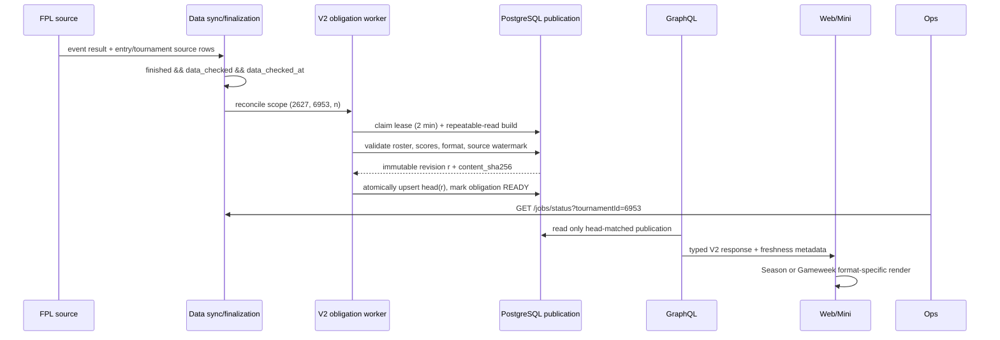

# My LetLetMe Tournament Review V2：端到端链路与发布报告

**审查对象**：以 tournament `6953` 为例，覆盖 Data → PostgreSQL →
GraphQL → Web → WeChat Mini Program → Ops。

**审查日期**：2026-08-31（代码审查、CI、部署与只读线上证据；不是全链路已发布声明）。

**决策**：V2 是唯一业务路径。V1 与 V2 发生语义冲突时舍弃 V1；不做
V1 fallback、兼容 alias 或双读。遗留 V1 代码只允许作为后置删除对象，不能再
承载新语义或进入生产请求路径。

## Executive Summary

这次审查把“我的 LetLetMe 赛事复盘”定义为**已结算快照复盘中心**：Season
看累计竞争格局，Gameweek 看单轮表现，未结算轮次统一回到 Live；POINTS 的
“本轮积分”以 Gross 为主指标，cost/Net 作为解释维度，H2H 与淘汰赛使用独立
布局。平台管理员通过 `ALL` 查看所有赛事；自定义赛事在 `setup_status = ready`
后走同一条 obligation/reconcile/publication 链路。

链路的结构性基础已经具备：Data 负责 source validation、PostgreSQL immutable
publication 与 atomic head，GraphQL 负责只读授权、revision pin、fail-closed
校验与 query cache，Web/Mini 负责 V2 contract header 与格式化页面。Data PR
`#366` 已以精确 SHA 部署，生产 `/health/deploy`、scheduler、worker 与
publication consistency 均为 true。

当前仍有三个发布阻断：

1. Data `#368` 已合并，但两次 exact-image deploy 都在 migration 前被
   staging-publication quiescence 安全拦截；`0082_tournament_review_source_floor_requeue.sql`
   尚未 apply，生产仍是 `#366` 的镜像/数据状态。
2. GraphQL `#193` tested code exact head 是
	`9a12d9b33ac1b0a56fabbaa42a47096948ea6b92`，verify 与 database-contract CI
	已通过；该 head 包含 H2H 结果、POINTS tournament score 和累计成本的
	fail-closed 校验，并进一步固定 review event `1..38` 边界、淘汰赛非平局胜者与
	权威平局 tiebreak。它也修复了此前针对 `4dca17f…` exact-head review 返回的 5 个 P2、
	随后发现的 1 个 P1 和 1 个 P2、最终 review 的 3 个 P2，以及最新 review 的 2 个 P2。
	当前报告/artefact 位于该 tested code head 之后的 docs commit；其 exact artifact
	head 必须单独取得 clean signal，不能把 CI green 当作 review clean。Web/Mini 仍
	pin 旧 GraphQL schema，不能宣称客户端 contract 已闭环。
3. 还没有带受保护凭证的 6953 publication/status 样本，因此真实 row count、
   head parity、Season 全历史窗口和端到端消费结果仍属于未验证项。

## 1. 业务口径

页面产品名统一为 **我的 LetLetMe 赛事复盘**，所有产品文案使用
“tournament / 赛事”，不把复盘页称为其他类型的赛事。

| 业务问题 | V2 结论 |
| --- | --- |
| 复盘看什么 | 只读已结算、不可变的 `(season, tournament, event)` 快照；未结算数据统一去 Live。 |
| Season 是否实时 | 否。Season 以已结算快照累计竞争格局，最新可见轮次由 publication head 决定；不会读取当前未结算轮次。 |
| Gameweek 看什么 | 单轮表现，必须通过 `finished = true`、`data_checked = true`、`data_checked_at` 门槛。 |
| 本轮积分 | Gross 是主标题；transfer cost、Net、tournament score 分开显示，不用 Net 冒充本轮积分。 |
| H2H / 淘汰赛 | 使用独立的 H2H / KNOCKOUT typed payload 和专属复盘布局，不强塞进 POINTS 表格。 |
| 普通用户范围 | 默认 `ACCESSIBLE`：本人 roster 或所在联赛可访问的赛事。 |
| 赛事管理员 | 可通过 `MANAGED` 语义读取自己管理的赛事；管理能力仍由现有写入/管理链路负责。 |
| 平台管理员 | Web 已验证身份可请求 `scope = ALL`，查看所有赛事；不能借此冒充其他 FPL entry。 |
| 自定义赛事 | 创建链路完成 `setup_status = ready` 后，由同一条 V2 obligation reconcile/backfill 链路发现，不另造一套数据源。 |

### 页面分工

```text
我的 LetLetMe 赛事复盘
├── Season：累计竞争格局（最新已结算快照）
├── Gameweek：单轮 Gross / cost / Net 或该格式的单轮结果
├── POINTS：排行榜与积分明细
├── H2H：对战、轮空、累计战绩与积分榜
└── KNOCKOUT：轮次、对阵、进球/胜者与晋级路径

未结算 GW ───────────────────────────────► Live
```

## 2. 端到端数据链路

### 2.1 总体流程

```mermaid
flowchart LR
  A[FPL / 上游源] --> B[Data sync jobs]
  B --> C[(fpl.events + competition facts)]
  C --> D{finished + data_checked + setup ready?}
  D -- 否 --> L[不进入复盘；留在 Live/等待源]
  D -- 是 --> E[5 分钟 tournament-review-v2 reconcile]
  E --> F[(durable obligation<br/>season,tournament,event)]
  F --> G[claim lease / advisory lock]
  G --> H{POINTS / H2H / KNOCKOUT}
  H --> I[完整性与 source freshness 校验]
  I -- 失败 --> R[WAITING_SOURCE / PENDING / DEGRADED + 补偿]
  I -- 通过 --> J[(immutable publication revision)]
  J --> K[(atomic tournament_review_heads)]
  K --> O[/jobs/status + Ops probe]
  K --> Q[GraphQL auth + contract gate]
  Q --> S[GraphQL query cache<br/>revision + args, TTL]
  S --> W[Web V2 页面]
  S --> M[Mini V2 页面]
```

### 2.2 单个 GW 的时序（6953 / GW *n*）



### 2.3 6953 的具体 scope

```text
scope = (season = current season, tournament_id = 6953, event_id = n)
format = resolveTournamentReviewFormat(tournament rules, n)
publication = (scope, revision = r, schema = my-tournament-review-v2)
head       = exactly one active pointer for scope -> r
```

`6953` 不应该被当成全局快照或全局缓存 key。一个 GW 的源延迟、坏
publication 或重试，只影响 `(currentSeason, 6953, n)`，不会让其他赛事整批
失效。

## 3. Data 输入、校验与落库

| 层 | 输入/表 | 关键门槛 | 产物 |
| --- | --- | --- | --- |
| 轮次 | `fpl.events` | `finished`、`data_checked`、`data_checked_at` 非空 | 复盘 eligible event |
| 赛事规则 | `competition.tournaments` | `setup_status = ready`；group/knockout window 决定唯一 format | POINTS/H2H/KNOCKOUT |
| 参赛范围 | `competition.tournament_entries` + `competition.entries` | roster 数量等于 `total_team_num`；`started_event` 晚于当前 GW 的 entry 标记 not applicable | expected/ready/not-applicable counts |
| POINTS | `competition.entry_event_results` + `tournament_points_group_results` | event points、transfer cost、event net、group rank、source timestamp 完整且不早于 event checkpoint | Gross、cost、Net、tournament score、Season cumulative |
| H2H | `competition.tournament_battle_group_results` + entry scores | match 行、实际双方、match points、roster coverage 完整；Season standings 只含 ready subjects | 对战、轮空、累计 standings |
| KNOCKOUT | `competition.tournament_knockout_results` + `tournament_knockouts` | 对阵、Net、进球字段、winner 必须属于该场双方且属于 roster | bracket / 晋级路径 |
| publication | `competition.tournament_review_publications` | immutable revision、typed payload、count、source span、hash 格式 | 可复用的事实快照 |
| active pointer | `competition.tournament_review_heads` | `(season,tournament,event)` 唯一；revision 与 content hash 必须匹配 | 产品可见版本 |
| retry state | `competition.tournament_review_obligations` | lease、attempt、failure fingerprint、ready revision 可审计 | 持久化补偿状态 |

### 3.1 格式解析

同一 finalized event 只归属一个 format。若规则窗口意外重叠，KO 边界优先，
避免同一 GW 同时出现 group 与 bracket 两个事实版本。

```text
knockout window -> KNOCKOUT
points_races window -> POINTS
battle_races window -> H2H
otherwise -> not eligible for review
```

### 3.2 POINTS 口径

```text
roundGross      = Σ entry_event_results.event_points
roundCost       = Σ event_transfers_cost
roundNet        = Σ event_net_points
tournamentScore = tournament_points_group_results.event_net_points
seasonGross     = Σ entry_event_results.event_points (max(group start, entry start) .. current finalized GW)
seasonNet       = Σ tournament_points_group_results.event_net_points (max(group start, entry start) .. current finalized GW)
```

`roundGross` 是页面“本轮积分”的唯一主口径；cost/Net 是解释维度，不覆盖
Gross。Data builder 会逐 entry 对账历史 finalized event 数量，并要求历史 gross
与 net 结果在各自 event checkpoint 后已同步；缺一轮就不发布。Season 查询把每个
row 的 `seasonGrossPoints/seasonNetPoints` 映射为 Season 表格值，不会把单轮 Gross
误显示为累计值。

## 4. 一致性、完整性与时效性契约

### 4.1 不变量

1. PostgreSQL 是业务真相；Redis 只能保存 GraphQL query cache。
2. publication 是 immutable；重复 payload 按 content hash 复用 revision，
   不制造无意义版本。
3. head 是唯一产品可见切换点；GraphQL 只读取 head 匹配的 publication，
   不拼接不同 revision 的兄弟数据。
4. publication 的 `expected = ready + notApplicable`，且 payload typed key
   必须与 `format` 相同。
5. 消费端要求 `event_data_checked_at <= source_min_checked_at <= source_max_checked_at <= published_at`。
   Data producer 将 `source_min_checked_at` 固定为 finalized event checkpoint，
   `source_max_checked_at` 表示所有已验证依赖中的最新时间；当前事件的 source
   行仍逐项要求不早于 checkpoint。历史/静态依赖可以更早，但不能直接成为
   persisted source-min 下界。
6. GraphQL 对坏 schema/metric version、坏计数、坏 hash、坏时间戳、坏 payload row 采取 fail-closed，
   返回数据完整性错误而不把半成品写入缓存。
7. H2H Season standings 的行数按 `readySubjectCount` 校验；尚未开始的 entry
   保留在 scope metadata，但不伪造对战战绩。
   FPL 的 Average Team 是合规的合成对手：计入真实 entry 的已赛、积分和
   points-for/against；match payload 也保留 `isAverage` 与其 settled score，
   `isBye` 才表示不计入已赛。
8. H2H 的每个历史 finalized event 必须至少有一条对阵记录，且历史 match 的
   `source_checked_at/updated_at` 不早于该 event checkpoint；缺轮或过期历史不发布。
9. GraphQL role 只读；Data writer 负责 publication/head/obligation 写入；
   RLS 与 grants 不允许客户端直接改 Data 表。

> **跨仓库兼容性门**：Data `#352` 的 `0077` migration 原始约束仍同时允许
> `source_min_checked_at <= event_data_checked_at`。因此在 Data `#368` 的 source-floor
> 修复部署、reconcile 并生成新 revision 之前，不能把 GraphQL 当前校验当作生产
> 已兼容；旧 immutable revision 不修改，只由新 head 指向重建后的 revision。

### 4.2 允许多少秒数据

| 时间预算 | 目标/硬线 | 说明 |
| --- | ---: | --- |
| catalog cache | 60s | 赛事目录与最新 head/obligation 状态；key 含 viewer、scope、revision 摘要。 |
| review/status GraphQL cache | 300s | key 含 Data revision/head revision 与查询参数；过期后重新从 PG head 读取。 |
| Mini 客户端 fresh TTL | 300s | V2 请求使用明确 contract header 与同一缓存策略。 |
| Mini stale fallback | 900s | 仅瞬时 transport 失败允许显示 stale，并保留错误状态；业务错误不降级为旧数据。 |
| worker cadence | 300s | `tournament-review-v2` 每 5 分钟 reconcile/process，单次最多 20 scopes。 |
| eligible → visible p95 | 900s | 从 `data_checked_at` 到消费端可见的目标。 |
| eligible → visible hard | 4500s | 超过约 75 分钟必须告警/人工介入，不得静默继续。 |
| Ops checkpoint max age | 600s | `/jobs/status` 超过 10 分钟未更新为 critical。 |
| pending warning / critical | 900s / 4500s | 最老未完成 obligation 的提醒与硬线。 |
| lease reclaim | 120s | worker 崩溃后 PROCESSING scope 可被重新认领。 |
| degraded repair horizon | 24h | 快速重试耗尽后每 15 分钟修复，超出窗口进入人工处理。 |

因此页面不承诺秒级结算。正常目标是结算 checkpoint 后 15 分钟内可见；
缓存最多让已可见响应再保持 5 分钟，Mini 只在传输故障时最多显示 15 分钟
stale。任何“未结算但看起来像已结算”的数据都不应进入此页面。

### 4.3 限流与复杂度上限

| 入口 | V2 限制 |
| --- | --- |
| catalog | GraphQL workload floor 10 |
| Gameweek / Season | workload floor 20；`first` 1..100 |
| status | workload floor 5；返回 obligation 元数据，不返回 payload/raw error |
| Data worker | my-fpl-orchestration lane；每次最多 20 个 due scopes |
| H2H/KO payload | 服务端分页；客户端先渲染当前 page，用户显式“加载更多”再沿 cursor 合并，避免全量 board 进入 DOM/WXML |
| Ops watch | `tournamentId=6953` 最多返回 38 个 event scopes |
| Redis | query cache 与 queue/rate-limit Redis 逻辑隔离；所有 query key 有有限 TTL |

`first=100` 是 Web/Mini 的单页上限，不是允许无限拉取的容量承诺；大赛事
仍必须沿 cursor 分页。GraphQL complexity 先于 resolver 执行，防止 aliases、
大 entry batch 或嵌套字段绕过 workload floor。

## 5. 失败分类与补偿

| 故障 | 可见状态 | 是否推进 head | 自动补偿 | 人工动作 |
| --- | --- | --- | --- | --- |
| event 尚未 finalized | `WAITING_SOURCE` 或无 obligation | 否 | 每 5 分钟 reconcile；source recheck 60/180/600s | 检查上游 `data_checked`，不手工伪造结算。 |
| roster/score/source timestamp 不完整 | `WAITING_SOURCE` | 否 | source recheck 不消耗 execution attempt；随后 15 分钟 repair | 修复对应源同步，不改 publication。 |
| DB serialization / transient execution error | `PENDING` | 否 | 60/300/900s execution retry | 查看 lease、attempt 与队列积压。 |
| 3 次快速尝试仍失败 | `DEGRADED` | 否 | 每 15 分钟，最多 24h | 超过 horizon 建立人工事件；不能把旧 revision 当新 GW。 |
| worker 崩溃/lease 过期 | `PROCESSING` → 可 reclaim | 否 | 120s lease 过期后 `SKIP LOCKED` 重领 | 确认无长期 PROCESSING 堆积。 |
| payload/count/hash/freshness 损坏 | Data 不发布；GraphQL `DATA_INTEGRITY_ERROR` | 否 | 修源后重新 build 新 revision | 检查数据库行、migration 与 content hash；禁止直接改 head。 |
| publication 与 head 不一致 | Ops critical；GraphQL 不读不匹配行 | 否 | 无静默 fallback；重新发布/修复 pointer | 以 PG 对账，保留旧 coherent revision 仅作为审计。 |
| GraphQL query cache miss/Redis outage | 延迟增加 | 不影响业务真相 | 从 PG head 读，成功后重建 cache | 检查 query-cache Redis，不把 cache 当 source of truth。 |
| 旧客户端没有 V2 header | HTTP 426 `CLIENT_UPGRADE_REQUIRED` | 不涉及 | 发布客户端后重试 | 不加 V1 alias 来掩盖切换。 |
| `/jobs/status` migration 尚未存在 | `tournamentReviewV2.unavailable`；Ops critical | 不涉及 | 应用部署可启动但不宣称 V2 ready | 先 apply migration、验证 grants/RLS，再切流。 |

失败补偿的核心规则是：**补同一 scope，生成新 revision，最后才切 head**。
不做跨赛事全局回滚，也不在 GraphQL 层计算或写回 Data 表。

## 6. 缓存与数据一致性详解

```text
Data PG publication (immutable)
        │  head revision + content hash
        ▼
GraphQL reads exact head-matched row
        │  dataRevision + head revision + args hash
        ▼
llm:gql:* query cache (TTL 60s/300s)
        │
        ├── Web SSR: no-store transport, server still sends V2 contract
        └── Mini: contract-aware L1/L2 cache, stale only on transport failure
```

这套设计牺牲了一次完全缓存命中的 DB metadata lookup，换取 head/revision
一致性证明：请求先知道当前 scope 的 head，再允许使用对应的 cache key。这样
不会因为 Redis 保留了旧 sibling revision 而把旧数据误标为最新。

## 7. 已实现的跨仓库改动

### Data

- `migrations/0077_tournament_review_v2_publications.sql`：publication、head、
  obligation、RLS、grants、typed payload/count/source-span 约束。
- `src/services/tournament-review-publication.service.ts`：三种 format builder、
  immutable revision/hash、repeatable-read + scope advisory lock、lease/retry/
  degraded repair、`6953` bounded status evidence。
- PR `#368`（合并前 head `cd9002882e698cab68c381e94048022602a9d1b1`，merge
  `530118af6da52001248bc969b0b518d40e302d2a`，2026-08-31 10:15 UTC）补齐
  source-floor producer 语义，并新增 `0082_tournament_review_source_floor_requeue.sql`：
  历史/静态依赖不再把 `source_min_checked_at` 推到 event checkpoint 之前；已经存在的
  旧 READY head 会被有界地撤下并重新入队。CI test/integration 均通过。两次 deploy run
  `33382095955`、`33382453786` 都在执行 migration 前发现
  `Database has 2 staging publication(s)`，因此没有停止服务、没有切 slot、没有 apply
  migration；不能把该修复当成生产已生效。
- `src/jobs/maintenance.jobs.ts`、`src/scheduler/job-registry.ts`、
  `src/workers/maintenance.worker.ts`：5 分钟 `my-fpl-orchestration` lane，
  每次最多 20 scopes。
- `src/services/jobs-status.service.ts`、`src/api/jobs.api.ts`：
  `/jobs/status?window=15m&tournamentId=6953` 只读探针数据。
- `docs/SYSTEM_CONTRACTS.md`、`docs/job-schedule.md`、`docs/cache-ttl-summary.md`、
  `docs/redis-contract.md`：权威、时效、缓存和重试契约。

### GraphQL

- `src/domains/my-fpl/tournament-review-v2.repository.ts`：scope SQL、active
  head join、obligation-format binding、format typed mapping、fail-closed
  integrity checks、分页和 query cache；POINTS 逐行对账 Gross/cost/Net，KO
  goals 只接受非负 GraphQL Int，所有 GraphQL Int aggregate 使用 32 位边界；
  Gameweek cache miss 按已观察的 immutable `(revision, content_sha256)` 读取，
  不因并发 active-head 切换把同一请求拼到另一版本；Season 通过单条 CTE 同时
  固定 finalized event-id 窗口、obligation 与 coherent head，缺 head/缺 obligation
  fail-closed；只读取最新已结算 payload，避免每次请求搬运/重算所有历史 payload；
  无 publication 时仍透传 PENDING/WAITING_SOURCE/DEGRADED obligation 状态。
- `src/domains/my-fpl/schema.ts` / `resolvers.ts`：catalog、Gameweek、Season、
  status V2 roots；Season POINTS 使用累计字段，返回自己的 freshness，并支持
  `first/after` cursor。
- `src/graphql/contract-gate.ts` + `src/bootstrap.ts`：V2 root 必须带
  `X-LetLetMe-Contract: my-tournament-review-v2`，否则 HTTP 426。
- `root-field-policy.ts` / `authorization.ts` / `limits.ts`：viewer、tournament
  member、platform admin `ALL` 以及 workload floors。

### Web

- `/app/[locale]/my-fpl/competitions/page.tsx` 改为 V2 SSR seed，只请求已结算
  catalog/Gameweek/Season。
- `/app/me/tournament/TournamentReviewV2Client.tsx` 提供 POINTS/H2H/KNOCKOUT
  三套 render，并分开展示 Gross、cost、Net、freshness/state；Gameweek/Season
  使用显式加载更多合并后续 cursor page。
- `lib/graphql-client.ts` 与 `lib/graphql/operations/my-fpl.ts` 发送 V2 header
  并提供 typed operations。

### WeChat Mini Program

- `miniprogram/services/graphql.service.ts`：contract header 进入请求、重试与
  cache variant，避免 V1/V2 cache collision。
- `miniprogram/services/tournament.service.ts`：V2 catalog/Gameweek/Season
  operations，`first/after` cursor、fresh 300s / stale 900s policy。
- `miniprogram/pages/my-fpl/leagues/leagues.ts/.wxml/.wxss`：V2 作为实际入口，
  管理员 `ALL` toggle、Season/Gameweek tabs、format-specific UI 和“加载更多”；
  V1 markup 不得作为 fallback，待 V2 正式切流后删除。

### Ops

- `config/probes.json` 增加 `tournament-review-v2`，固定 watch `6953`。
- `bin/vps-maintenance` 校验 schema、freshness、obligation count、head parity、
  pending age、degraded 和 watch revision；不调用受保护 GraphQL，不泄露 payload。

## 8. 当前验证证据

| 仓库 | 已执行证据 | 结果 |
| --- | --- | --- |
| Data | `bun run format:check`、`bun run typecheck`、`bun run lint`；`tournament-review-*` 聚焦测试；完整 `bun test tests/unit` | `#368` 本地 1499 tests / 0 fail；source-floor 聚焦 23 / 0 fail；CI test/integration 通过；部署因两个 staging publication 的 quiescence gate 停止在 migration 前 |
| Data production | PR `#366` merge `9d7d0ae9e8924b2cf97098cdad935bb37f985cc3`；deploy run `33375793861`；`/health/deploy`、`/health/ready`、`/health/live` | 已证明 #366 部署 identity、scheduler、worker、publicationConsistency 为 true；#368 尚未生效，且尚未证明 6953 受保护 publication 消费样本 |
| GraphQL | PR `#193` tested code head `9a12d9b33ac1b0a56fabbaa42a47096948ea6b92`；focused 90 / 0 fail；完整 1053 pass、7 skip、0 fail、1 snapshot、3518 expect；typecheck、lint、format、layers、docs、deprecation、Bun build；CI verify/database-contract `33415701328`、`33415700382` 均通过 | 此前 `4dca17f…` exact-head review 的 5 个 P2、随后 1 个 P1/1 个 P2、最终 review 的 3 个 P2，以及最新 review 的 2 个 P2 已修复并 disposition/resolve；当前报告/artefact 位于其后 docs commit，仍待该 exact artifact head review；不得把 CI green 当作 clean review |
| Web | `npm run typecheck`、`npm run lint`；完整 `npm test -- --runInBand` | 771 tests / 0 fail；PR #266 仍 pin 旧 GraphQL contract，不能作为最终消费者证据 |
| Mini | `npm run typecheck`、`npm run lint`；完整 `npm test -- --runInBand` | 599 tests / 0 fail；PR #82 当前 CONFLICTING，且仍 pin 旧 GraphQL contract |
| Ops | `python3 -m unittest tests/test_vps_maintenance.py`、`py_compile`、`git diff --check` | 通过，152 tests / 0 fail |

这些是干净隔离 worktree 的本地代码证据，不等于已经 apply migration、部署或
线上观测。Web/Mini 的 `contract:graphql` 仍需要本地 GraphQL 在
`127.0.0.1:4000` 运行；连接拒绝时不能把 contract check 记为通过。

### 8.1 Gate ledger

| Gate | 状态 | 证据/缺口 |
| --- | --- | --- |
| Data producer source floor | 已合并、未生效 | `#368` merge `530118af...`、CI test/integration 通过；deploy `33382095955`/`33382453786` 因 `Database has 2 staging publication(s)` 停在 migration 前；`0082` apply/reconcile/backfill 未验证 |
| Data runtime deployment | #366 已通过；#368 阻塞 | #366 有 exact deploy SHA、health probes、scheduler/worker/publication consistency；#368 尚未切 slot，`/jobs/status?tournamentId=6953` 仍需受保护凭证样本 |
| GraphQL schema/read path | CI/local gate 通过，待最终 exact-head review | tested code head `9a12d9b33ac1b0a56fabbaa42a47096948ea6b92`；focused 90、完整 1053、CI 4 项通过；此前 `4dca17f…` exact-head review 的 5 个 P2、随后 1 个 P1/1 个 P2、最终 review 的 3 个 P2，以及最新 review 的 2 个 P2 已修复并 disposition/resolve；当前报告/artefact 位于其后 docs commit，必须再取得 clean signal |
| Web/Mini consumer contract | 未通过 | 两个客户端仍 pin 旧 GraphQL ref，Mini PR 还有 merge conflict；必须在 GraphQL merge SHA 后更新 pin、跑 contract 与消费者路径 |
| 6953 end-to-end publication | 未验证 | 缺少带保护凭证的 head/publication/count/hash/source span/Redis-cache 对账；不能从 health 200 推断 |
| V1 retirement | 设计已决定，执行未完成 | V1 不再是 fallback/alias/double-read；客户端切流完成后删除遗留 roots、loader、markup、queries 与文档 |

## 9. 发布前 Gate 与 V1 退出条件

按以下顺序执行，任一项失败都停在当前版本，不做隐式 V1 fallback：

1. 在备份和 migration login contract 通过后 apply 至 `0082`（包含 `0077`
   publication schema 与 `0082` source-floor requeue）。当前 deploy 已被
   staging-publication quiescence gate 拦住，不能通过清空/绕过该 gate 继续；先收敛
   staging publication，再验证表、索引、grants、RLS 与 runtime reader/writer identity。
2. 对当前 season 运行 reconcile/backfill；用 `6953` 验证至少一个 POINTS、
   H2H 或 KNOCKOUT scope 的 source freshness、payload count、hash、head、
   obligation 全部一致。
3. 以只读凭证检查 PostgreSQL publication/head；以认证 Redis 凭证确认 query
   cache key 含 revision 且不会把 cache 当业务真相。
4. 部署 GraphQL，验收 exact SHA、`/health/ready`、V2 header 426/200、
   `ACCESSIBLE`/`ALL` authorization、代表性 query 和 rate-limit outcome。
5. 部署 Web 与 Mini，确认实际流量全部带 V2 header；验证 Season/GW、Gross、
   H2H、KO、管理员全部赛事、自定义赛事创建后 backfill。
6. 开启 Ops probe，连续观察至少一个结算窗口：`eligible→visible`、pending age、
   head parity、degraded、cache stale、GraphQL/Web/Mini 端到端结果。
7. 做故障演练：源延迟、worker crash/lease reclaim、publication insert failure、
   head mismatch、Redis unavailable、旧客户端 426；确认每类都按上表行为收敛。
8. V2 是唯一业务路径：旧客户端收到 426，不能路由到 V1。所有客户端完成 V2
   且线上无 V1 请求后，删除 GraphQL V1 roots、Web 旧 loader、Mini 旧
   markup/queries、对应 tests/docs，并重新生成 domain manifest；遗留代码在清理
   前也不得重新进入生产请求路径。

## 10. 复杂度 trade-off 结论

| 选择 | 获得 | 成本/风险 | 结论 |
| --- | --- | --- | --- |
| PG immutable publication + head | 可审计 revision、原子切换、故障可重放、不会混 sibling | 每个 scope 多一次写入与 retention 管理 | 对复盘正确性值得，保留。 |
| 不建第二个 Data Redis business cache | 少一个 source of truth、避免双写/失配 | Redis 命中不能完全绕过 PG head metadata | 对已结算低频读，正确性优先，保留。 |
| typed POINTS/H2H/KO | 页面语义清晰、不会把 KO/H2H 塞进积分表 | schema、测试和 UI 分支更多 | 与业务差异一致，保留。 |
| durable obligation + lease + 24h repair | 进程崩溃、源延迟、执行失败可区分补偿 | 状态机和 Ops 指标复杂 | 复盘必须可追责，保留。 |
| 5 分钟 cadence / 20 scopes | 可预测 DB/worker 负载 | 大规模赛事会拉长尾部时延 | 用 pending age/queue metrics 观测后再调，不先盲目放大。 |
| first ≤ 100 + cursor | 防止单请求/DOM/WXML 爆炸 | 前端需要分页体验 | 保留硬上限。 |
| Season 最新 payload + event-id 窗口 | 低内存、低网络、避免每次扫描历史 JSON | 历史 payload 不在每次 Season read 中重新 hash | Data builder 已增加逐事件计数/来源 checkpoint 门槛；immutable publication、worker hash 和真实历史窗口回放仍需上线前验证。 |
| V1 路径清理 | 可避免双语义、双读和缓存碰撞 | 不能再用旧页面做业务回滚 | V2 上线即拒绝旧 contract；验收后删除遗留 roots/loader/markup。 |

**最终判断**：V2 已把“已结算赛事复盘”从一次性页面查询升级为有 scope、
revision、head、freshness、retry、auth、cache、Ops evidence 的小型数据产品。
最大的剩余风险不是代码结构，而是发布前的真实 migration/backfill、跨客户端
切流、故障/容量演练和线上观测。虽然 builder 已拒绝缺历史结果/缺 H2H 历史轮次
或过期 source checkpoint，仍需用真实数据证明 Season cumulative 窗口确实覆盖
6953 的全部适用 event，确认 120 秒 lease 不会在大 payload 构建期间被错误
reclaim，并验证超过 20 scopes/5 分钟时 pending tail 的 SLO。以上 Gate 完成
之前，不应宣称 6953 已生产就绪。

## 11. 范围、方法、限制与后续问题

### 范围与方法

本报告固定一个业务例子 `tournament_id = 6953`，并沿着 source → Data sync/finalize
→ PostgreSQL publication/head → GraphQL authorization/read model → query cache
→ Web/Mini consumer → Ops evidence 逐层审查。每一层分别记录代码、测试、CI、部署
和消费者证据；任何层缺少真实受保护样本，都标记为“未验证”，不以相邻层的健康
检查替代。时间预算是目标/硬线，不是实测 p95；实测必须在真实结算窗口和受控负载
下补采。

### 限制

- 本轮没有使用生产写权限、没有手工改 Data 表或 Redis，也没有绕过 migration、
  auth 或 rate-limit gate。
- 当前只读证据没有包含 6953 的真实 publication payload、row count、head revision、
  content hash、source span 或 GraphQL/Web/Mini 消费响应；因此完整性、一致性和
  freshness 的“设计成立”不能等同于“该赛事已经成立”。
- Data `/health/deploy` 证明的是部署与依赖状态；`/jobs/status`、内部 job lane 和
  Redis key 需要受保护凭证并按最小范围采样。
- Season cumulative 的 event-id 窗口、H2H 每一轮覆盖、淘汰赛 bracket 连续性和
  自定义赛事 setup-to-ready 需要真实数据回放，不能用单元测试替代。

### 后续问题

1. `#368` merge/deploy 后，`0082` 实际撤下并重建了多少旧 head？6953 的新 revision
   是否满足 `event_data_checked_at <= source_min <= source_max <= published_at`？
2. 真实结算窗口中 `eligible → visible` p50/p95/p99、最老 pending age、20 scopes
   每 5 分钟的 queue tail 是否符合 900s/4500s 硬线？
3. 大 payload 构建期间 120s lease renewal 是否稳定，是否存在错误 reclaim 或重复
   publication？
4. GraphQL merge SHA 更新 Web/Mini pin 后，`ACCESSIBLE`、tournament manager 和
   platform admin `ALL` 三种身份是否都只读到同一 coherent head？
5. 自定义赛事创建、setup failure、重试和删除后的 publication/head/缓存清理是否
   已在真实环境演练，并确认不会恢复 V1 fallback？
